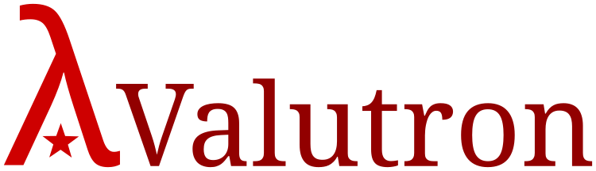

==============================

Valutron is a pure object-oriented programming platform centred on a fast
virtual machine. In the near-future Valutron will run directly on x86_64
computers, but for now the virtual machine is under hosted development. A world
of objects is provided by Valutron, and diverse programming languages may be
hosted atop this world, benefitting from equality of citizenship therein, with
all languages able to interoperate comprehensively with one another. Two
languages are made available at present: Valigent and Valuscript.

### Valigent

Valigent is Valutron's native programming language: a classical object-oriented
language in the Smalltalk tradition. Deriving ultimately from Budd's
LittleSmalltalk V3 via Public Domain Smalltalk, Valigent is thus genetically a
LittleSmalltalk, but has significantly diverged and aims for some measure of
compliance with the ANSI Smalltalk standard.

### Valuscript

Valuscript is an alternative language for Valutron: an ECMAScript-like language
based on the ECMAScript 2022 spec (but in many respects incomplete and
noncompliant with that spec.) It is not in the repository yet.

Virtual Machine
---------------

The Valutron VM is at the centre of the system as takes the form of a register
machine modified with an accumulator register acting as an implicit operand and
destination of all instructions. 